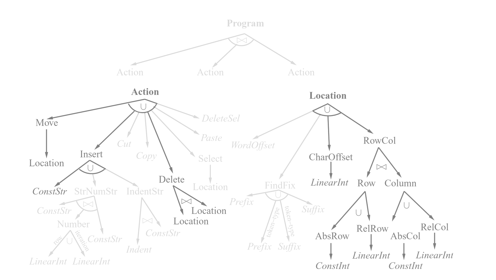

# Version Space Algebra for Text Editing
Alex Maclean, Bailey Wickham

## Progress
We began our implemtation in python (see the scratch-work directory) but chose to switch to Racket inorder to use a more functional style where the alagebra was abstracted away from the details of this application. Our final code can be seen in the racket files in the root of this repo. To see an example of what our implementation can do, see the tests in version-space.rkt

## What We Implemented


## Example
```scheme
> (define del-row (update Action (Document "111\n222\n333\n444" '(1 . 0)) 
                          (Document "111\n333\n444" '(1 . 0))))
> (execute del-row (Document "----\n******\n&&&&&" '(0 . 0)))
(list
 (Document "----\n&&&&&" '(0 . 0))
 (Document "----\n******\n&&&&&" '(0 . 0))
 (Document "----\n\n******\n&&&&&" '(0 . 0))
 (Document "&&&&&" '(0 . 0))
 (Document "******\n&&&&&" '(0 . 0))
 (Document "\n******\n&&&&&" '(0 . 0)))
 
> (define better-del-row (update del-row (Document "a\ne\ni\no\nu" '(3 . 0))
                                 (Document "a\ne\ni\nu" '(3 . 0))))
> (execute better-del-row (Document "zero\none\ntwo\nthree\nfour" '(2 . 0)))
(list
  (Document "zero\none\nthree\nfour" '(2 . 0)))
```

## References
- https://homes.cs.washington.edu/~pedrod/papers/mlc00c.pdf
- https://www.brinckerhoff.org/clements/2214-csc530/Files/lwdw-string-vsa-2003.pdf
