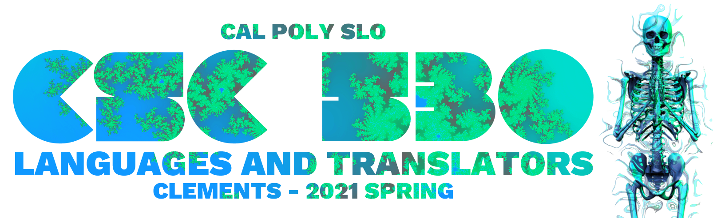

# 

All assignments from the 2021 Spring session of CSC 530 taught by John Clements at Cal Poly SLO (offered virtually). Each implements some of the work from a research paper on the topic of program synthesis. All but the first assignment were written by myself and Bailey Wickham.

## Contents

* **[Assignment 1](Assignment-1)** - Superoptimizer
* **[Assignment 2](Assignment-2)** - Lambda Calculus Translation
* **[Assignment 3](Assignment-3)** - Version Space Algebra for String Editing
* **[Assignment 4](Assignment-4)** - Analysis using Constraints
* **[Assignment 5](Assignment-5)** - Autograder
* **[Assignment 6](Assignment-6)** - Rosette Intro
